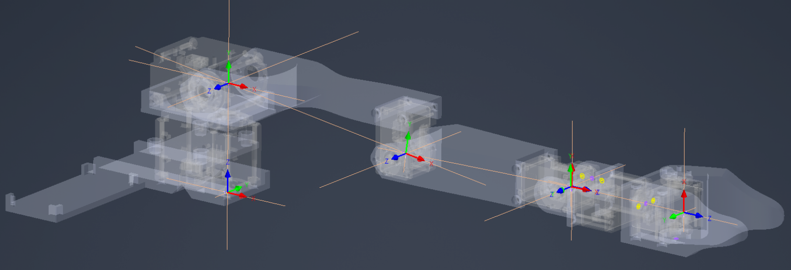

# Koch V1.1 — Project Overview

A compact, high-level stack for controlling the **Koch V1.1** manipulator (5 joints + gripper) using Robotis **Dynamixel** servos.

* High-level motion facade: [`KochV1_Robot`](kochV1_robot.md)
* Bus + device layer: [`KochV1_DxlBus`](kochV1_DxlBus.md) / [`DxlBus`](dxl_bus.md)
* Kinematics: [`KochV1_KinematicsModel`](kochV1_kinematics.md)

---

## Contents

* [What’s in this repo](#whats-in-this-repo)
* [Introduction and Conveniences](#system-at-a-glance)
    * [Kinematic Model](#kinematic-model-of-koch-v11)
    * [Units](#utilsunit)
    * [Data Converting](#data-converting)
* [Requirements](#requirements)
* [Documentation map](#documentation-map)

---

## What’s in this repo

* **`KochV1_Robot`** — API for moving the arm, reading joints, running IK/FK, and controlling the gripper. See: [KochV1 Robot — Module Documentation](kochV1_robot.md).
* **`Dynamixel-SDK Wrapper`** — API for interacting with `dynamixel-sdk` package.  See: [`dxl-wrapper`](dxl_wrapper_overview.md)
* **Kinematics** — FK/IK/Jacobian typed over DH. See: [kochV1_kinematics](kochV1_kinematics.md).
* **Motor specs** — typed control tables for XL-430-W250 / XL-330-M288. See: [motor_specs](motor_specs.md).
* **Utils** — units, packing/unpacking, helpers. See: [utils](utils.md).

---

## Introduction and Conveniences

A brief description of the Koch V1.1 kinematic model and the project-wide conveniences.

### Kinematic model of Koch V1.1



* **DH parameters** (from the figure; units converted in code to meters/radians). Offsets appear in the (\theta_{\text{DH}}) column and are implemented as `q_offset` in `DHJoint`.

| Joint | a [mm] | alpha [deg] | d [mm] | theta [deg]    |
| ----: | -------------------: | -----------------------: | -------------------: | ------------------------ |
|     1 |                    0 |                       90 |                56.30 | theta_1               |
|     2 |               109.31 |                        0 |                    0 | theta_2 + 7.78  |
|     3 |               100.51 |                        0 |                    0 | theta_3 - 9.32  |
|     4 |                    0 |                       90 |                    0 | theta_4 - 88.46 |
|     5 |                    0 |                        0 |                68.15 | theta_5               |

---

### `utils.Unit`

`Unit` is the enum used across the project to select units.

```python
from dynamixel.utils import Unit
# Goal Position (angle)
Unit.RAD, Unit.DEG
# Angular Velocity
Unit.RAD_S, Unit.RPM
# Raw register units (ticks)
Unit.DXL
```
---

### Data Converting

The `utils` module provides helper functions for unit and register conversions:

```python
from dynamixel.utils import (
    Unit,
    to_dxl_units, from_dxl_units, convert_angle,
    to_u32, pack_i32_le, unpack_i32_le,
)
```
> It is recommended to use prepared functions

## Requirements

* **Python** 3.10+
* **sympy**
* **numpy**
* **dynamixel-sdk**

```bash
pip install sympy numpy dynamixel-sdk
```

> Recommended: use these helpers for all conversions (angles, velocities, and 32-bit packing/unpacking) to avoid off-by-one and sign issues.

## Documentation map

* High-level control (recommended entry): **[KochV1 Robot — Module Documentation](kochV1_robot.md)**
* Bus + devices (sync groups, modes): **[KochV1_DxlBus](kochV1_dxl_bus.md)** -> base **[DxlBus](dxl_bus.md)**
* Kinematics (FK/IK/J): **[kochV1_kinematics](kochV1_kinematics.md)**
* Motors/spec tables: **[motor_specs](motor_specs.md)**
* Unit conversions & packing: **[utils](utils.md)**
* Extra reading: **[Understanding Motor Control Modes](understanding_motor_control_modes.md)** · **[Motor calibration](motor_calibration.md)**

---

